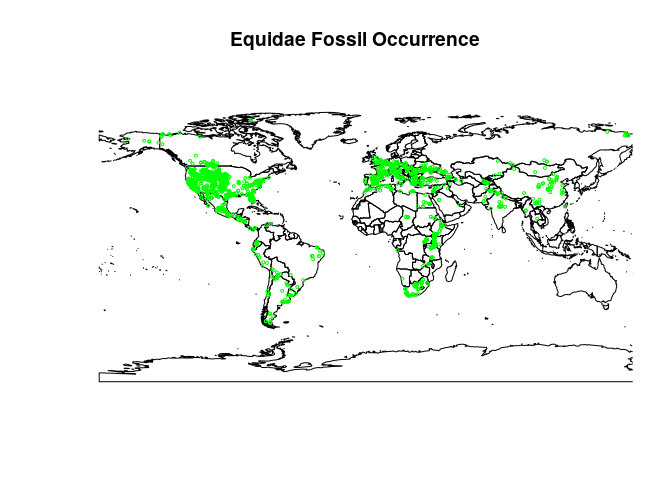

    airports <- read.csv("./eq_new_col.csv", header = TRUE)
    #install.packages("rworldmap")
    head(airports)

    ##   collection_no record_type   formation         lng      lat
    ## 1         11601         col Jewett Sand -118.848335 35.49278
    ## 2         11798         col              102.066666 25.01667
    ## 3         11799         col               32.866669 39.93333
    ## 4         11803         col               35.049999 32.71667
    ## 5         12840         col                1.733333 44.16667
    ## 6         13060         col               76.666664 31.53333
    ##                      collection_name collection_subset
    ## 1 Pyramid Hill Sand Member grit zone                NA
    ## 2                             Lufeng                NA
    ## 3                             Yozgat                NA
    ## 4             Tabun Cave Level C & D                NA
    ## 5                          Le Bretou                NA
    ## 6                           Ladhyani                NA
    ##                                   collection_aka n_occs   early_interval
    ## 1 LACMVP Loc. 1603, 1626, 1627; UCMP Loc. V-7032      1       Aquitanian
    ## 2                                                     2         Turolian
    ## 3                                                     2     Late Miocene
    ## 4                                                     2 Late Pleistocene
    ## 5                            Quercy Phosphorites      1        Bartonian
    ## 6                                                     1     Late Miocene
    ##    late_interval max_ma  min_ma reference_no
    ## 1                23.030 20.4400        10315
    ## 2                 8.700  5.3330        10883
    ## 3 Early Pliocene 11.608  3.6000         4198
    ## 4                 0.126  0.0117        10604
    ## 5                41.300 38.0000         7272
    ## 6                11.608  5.3330         4341

    library(rworldmap)

    ## Loading required package: sp

    ## ### Welcome to rworldmap ###

    ## For a short introduction type :   vignette('rworldmap')

    newmap <- getMap(resolution = "low")
    plot(newmap, xlim = c(-180,150 ), ylim = c(-40, 55), asp = 1)
    points(airports$lng, airports$lat, col = "green", cex = .4)
    title("Equidae Fossil Occurrence")

 \#not
useful stuff

install.packages("maps")
========================

install.packages("geosphere")
=============================

library(maps) library(geosphere) map("world") xlim &lt;- c(-180, 150)
ylim &lt;- c(-40, 80) map("world", col="\#f2f2f2", fill=TRUE,
bg="white", lwd=0.05, xlim=xlim, ylim=ylim) airports &lt;-
read.csv("eq\_new\_col.csv", header=TRUE) flights &lt;-
read.csv("eq\_new\_col.csv", header=TRUE, as.is=TRUE) map("world",
col="\#f2f2f2", fill=TRUE, bg="white", lwd=0.05, xlim=xlim, ylim=ylim)

fsub &lt;- flights\[flights$airline == "AA",\] for (j in
1:length(fsub$airline)) {  air1 &lt;- airports\[airports$iata ==
fsub\[j,\]*a**i**r**p**o**r**t*1, \]*a**i**r*2 &lt; −*a**i**r**p**o**r**t**s*\[*a**i**r**p**o**r**t**s*iata
== fsub\[j,\]$airport2,\]

    inter <- gcIntermediate(c(air1[1,]$long, air1[1,]$lat), c(air2[1,]$long, air2[1,]$lat), n=100, addStartEnd=TRUE)
             
    lines(inter, col="black", lwd=0.8)
