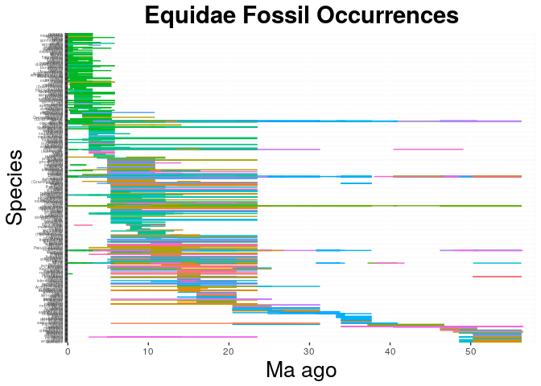
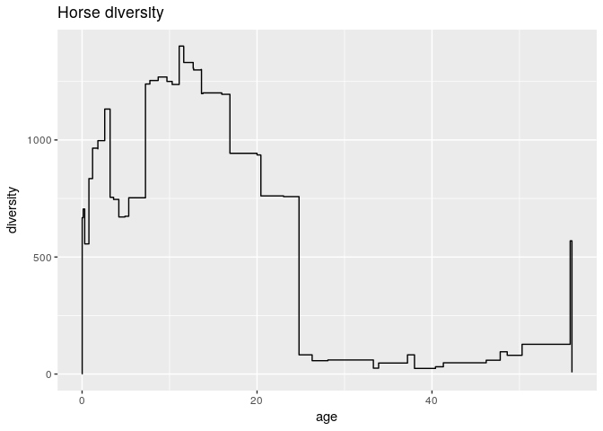

    library(ggplot2)
    equidaes <- read.csv("~/Desktop/eeb-177/eeb-177-final-project/eq22.csv", header = F, as.is = T)
    names(equidaes) <- c("genus", "species", "minage", "maxage")

    #define y range as the min and max age and color representing genus
    #equidaes_occ <- ggplot(equidaes, aes( species, ymin = maxage, ymax=minage, #colour = genus))
    #equidaes_occ <- equidaes_occ + geom_linerange()+ #theme(legend.position="none")+ coord_flip()+  theme(axis.text.y = #element_text(size=3))+ theme(axis.ticks.y=element_blank()) + #scale_y_continuous(limits=c(0,70), expand = c(0, 0), breaks=c(0, 10, 20, 30, #40)) + labs(title = "Equidae Fossil Occurrences", x = "Species", y = "Ma #ago") + theme(plot.title = element_text(hjust = 0.5, size=22, face = "bold"), #axis.title =element_text(size=20))
    #install.packages("forcats")
    library(forcats)
    equidaes_occ <- ggplot(equidaes, aes( x = fct_reorder(species, minage, .desc = T), maxage, colour = genus))

    equidaes_occ <- equidaes_occ + geom_linerange(aes(ymin = minage, ymax = maxage + 0.5)) + theme(legend.position="none") +  coord_flip() +  theme(axis.text.y = element_text(size=3.5)) + scale_y_continuous(limits=c(0, 58), expand = c(0, 0), breaks=c(0, 10, 20, 30, 40, 50)) + labs(title = "Equidae Fossil Occurrences", x = "Species", y = "Ma ago") + theme(plot.title = element_text(hjust = 0.5, size=22, face = "bold"), axis.title =element_text(size=20)) 

    equidaes_occ

    #installed.packages("dplyr")
    library(tidyr)
    library(dplyr)

    ## 
    ## Attaching package: 'dplyr'

    ## The following objects are masked from 'package:stats':
    ## 
    ##     filter, lag

    ## The following objects are masked from 'package:base':
    ## 
    ##     intersect, setdiff, setequal, union

    diversity <- equidaes %>% gather(key = type, value = age, minage, maxage) %>% mutate(count = ifelse(type == "maxage", 1, -1)) %>% group_by(age) %>% summarise(count = sum(count))  %>% arrange(-age, -count) %>% mutate(diversity = cumsum(count)) 

    ggplot(diversity, aes(x = age, y = diversity)) + geom_step() + ggtitle("Horse diversity")

