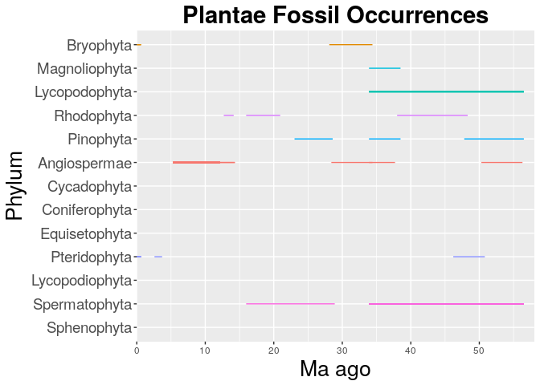
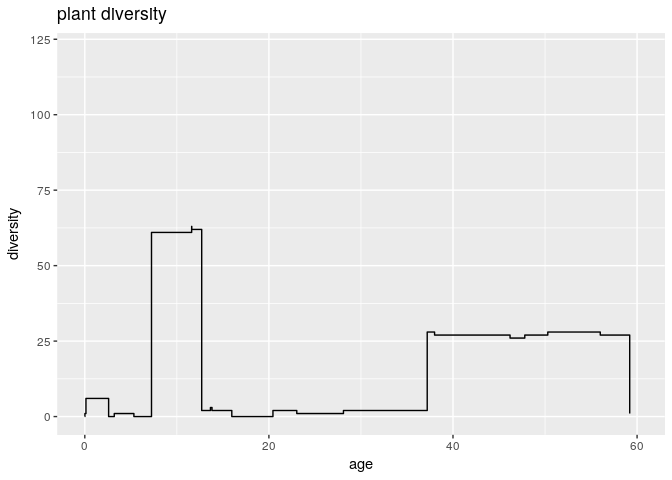

    #install.packages("forcats")

    library(ggplot2)
    plants <- read.csv("~/Desktop/eeb-177/eeb-177-final-project/plant/plant_genus_ave.csv", header = F, as.is = T)
    names(plants) <- c("family", "maxage", "minage", "average")

    library(forcats)
    plants_occ <- ggplot(plants, aes( x = fct_reorder(family, minage, .desc = T), maxage, colour = family))

    plants_occ <- plants_occ + geom_linerange(aes(ymin = minage, ymax = maxage + 0.5)) + theme(legend.position="none") +  coord_flip() +  theme(axis.text.y = element_text(size=14)) + scale_y_continuous(limits=c(0, 58), expand = c(0, 0), breaks=c(0, 10, 20, 30, 40, 50)) + labs(title = "Plantae Fossil Occurrences", x = "Phylum", y = "Ma ago") + theme(plot.title = element_text(hjust = 0.5, size=22, face = "bold"), axis.title =element_text(size=20)) 
    plants_occ

    ## Warning: Removed 275 rows containing missing values (geom_linerange).

    #install.packages("dplyr")
    library(tidyr)
    library(dplyr)

    ## 
    ## Attaching package: 'dplyr'

    ## The following objects are masked from 'package:stats':
    ## 
    ##     filter, lag

    ## The following objects are masked from 'package:base':
    ## 
    ##     intersect, setdiff, setequal, union

    diversity1 <- plants %>% gather(key = type, value = age, minage, maxage) %>% mutate(count = ifelse(type == "maxage", 1, -1)) %>% group_by(age) %>% summarise(count = sum(count))  %>% arrange(-age, -count) %>% mutate(diversity = cumsum(count)) 

    ggplot(diversity1, aes(x = age, y = diversity)) + geom_step()+ ggtitle("plant diversity")+ scale_x_continuous(limits=c(0, 60))

    ## Warning: Removed 65 rows containing missing values (geom_path).

    #library(ggplot2)
    #lent <- read.csv("~/Desktop/eeb-177/eeb-177-final-project/sp_len_min_max_range_ave.csv#", header = F, as.is = T)
    #names(lent) <- c("species", "len", "minage", "maxage", "range", "average")

    #library(forcats)
    #lent_occ <- ggplot(lent, aes( x = fct_reorder(species, average, .desc = T), #average+len , colour = species))

    #lent_occ <- lent_occ + geom_linerange(aes(ymin = average, ymax = len+average)) + #theme(legend.position="none") +  coord_flip() +  theme(axis.text.y = #element_text(size=5)) + scale_y_continuous(limits=c(0, 60), expand = c(0, 0), #breaks=c(0, 10, 20, 30, 40, 50)) + labs(title = "Length of Equidae Fossils", x = #"Species", y = "Ma ago") + theme(plot.title = element_text(hjust = 0.5, size=22, face #= "bold"), axis.title =element_text(size=20)) 
    #lent_occ

    #install.packages("dplyr")
    #library(tidyr)
    #library(dplyr)
    #diversity2 <- lent %>% gather(key = type, value = age,average) %>% mutate(count = #ifelse(type == "average", 1, -1)) %>% group_by(age) %>% summarise(count = sum(count)) # %>% arrange(-age, -count) %>% mutate(diversity = cumsum(count)) 

    #ggplot(diversity2, aes(x = age, y = diversity)) + geom_step()

    #install.packages("multiplot")

    #library(grid)
    #library(gridExtra)
    #plot_grid(diversity2,diversity1, cols=2)
